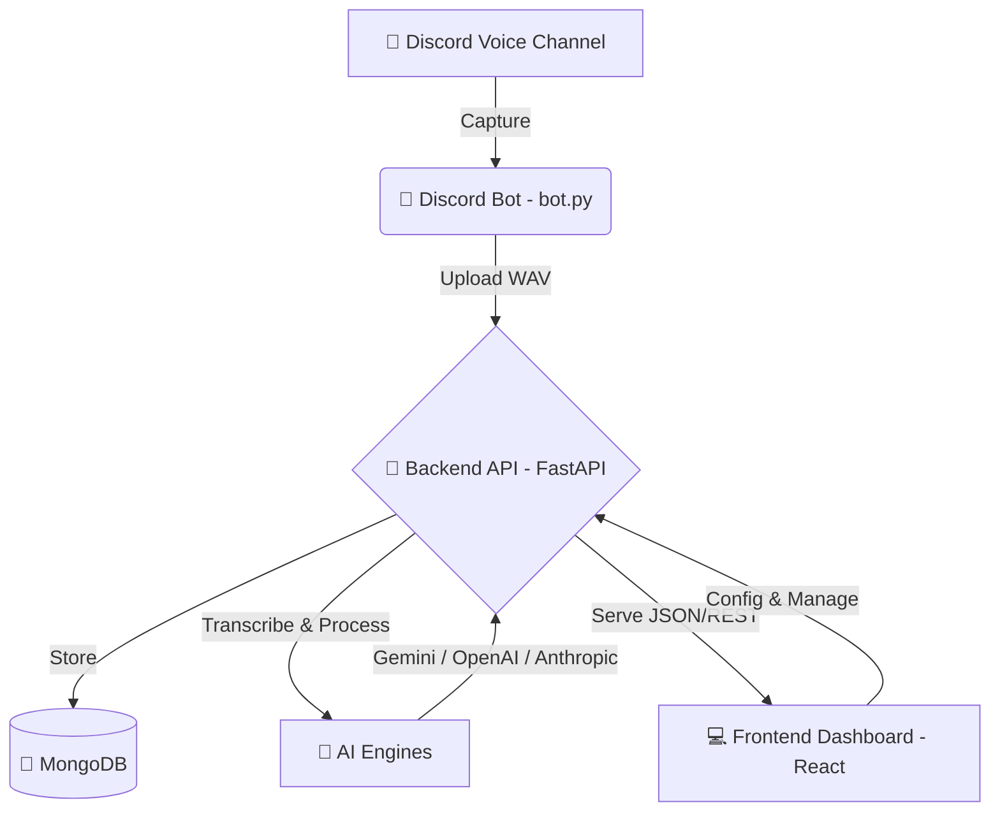

# 🎙️ EchoBot: O Cronista das Sombras

**EchoBot** é um sistema avançado de crônica automática para RPG de mesa. Ele captura áudio diretamente das suas sessões no Discord, utiliza modelos de Inteligência Artificial de elite (**Gemini**, **GPT-4o**, **Claude 3.5**) para transcrever e processar a narrativa, gerando um diário técnico e um roteiro de revisão pronto para ser narrado ou arquivado.

---

## 🏛️ Arquitetura do Sistema

O EchoBot é composto por uma trindade de componentes que trabalham em harmonia:



---

## ✨ Funcionalidades

- **Captura de Voz em Tempo Real**: O bot entra no seu canal de voz e grava a sessão com alta fidelidade.
- **Transcrição Multiprovedor**: Alternância inteligente entre Google Gemini e OpenAI Whisper para garantir precisão e contornar limites de cota.
- **Processamento Narrativo**:
    - **Filtragem IC/OOC**: Separa falas de personagens de conversas paralelas sobre regras.
    - **Diário Técnico**: Extração automática de NPCs, Itens, Locais e XP.
    - **Roteiro de Revisão**: Gera um resumo narrativo fluido, substituindo nomes de jogadores por nomes de personagens.
- **Painel de Gestão**: Interface gótica personalizada para gerenciar sessões e mapear usuários do Discord para seus personagens.

---

## 🚀 Guia de Início Rápido

### Pré-requisitos
- **Python 3.10+** (recomendado `venv`)
- **Node.js 18+**
- **MongoDB** (Local ou Atlas)
- **FFmpeg** instalado e no PATH do sistema.

### 1. Preparação do Ambiente
Clone o repositório e configure as variáveis de ambiente nos arquivos `.env` dentro de `/backend` e `/frontend`.

### 2. Instalação das Dependências

**Backend:**
```bash
cd backend
python -m venv venv
.\venv\Scripts\activate
pip install -r requirements.txt
```

**Frontend:**
```bash
cd frontend
npm install
```

### 3. Configuração do Bot Discord
1. Acesse o [Discord Developer Portal](https://discord.com/developers/applications).
2. Crie uma nova aplicação e adicione um Bot.
3. Ative os **Privileged Gateway Intents** (`Message Content`, `Server Members`).
4. Copie o Token e configure-o na página de **Settings** do EchoBot ou no `.env`.
5. Convide o bot para seu servidor com permissões de `Connect` e `Speak`.

### 4. Executando o Sistema
Para sua conveniência, utilize o script unificado em PowerShell:
```powershell
./run.ps1
```
Este script iniciará o Bot, o Servidor API e o Dashboard em janelas separadas.

---

## 🛠️ Detalhes Técnicos (Architect Review)

- **Backend**: FastAPI com Motor (driver assíncrono para MongoDB).
- **Frontend**: React + Tailwind CSS + Radix UI. Design focado em estética *Gothic/RPG*.
- **Bot**: Desenvolvido em Discord.py com suporte a Sinks para gravação de áudio.
- **IA**: Suporte nativo e redundante para as APIs mais potentes do mercado, configuráveis via interface.

### ⚠️ Notas de Portabilidade
Atualmente, o bot está configurado com caminhos específicos para o FFmpeg e a DLL do Opus em ambiente Windows. Para produção, recomenda-se mover esses caminhos para variáveis de ambiente.

---

## 📜 Licença
Este projeto é uma ferramenta de apoio à narrativa e segue as diretrizes de código aberto para a comunidade de RPG.

*“Que suas falas sejam épicas e suas crônicas, eternas.”*
