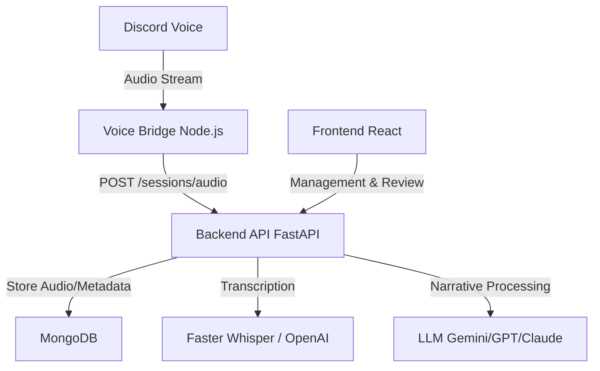

# EchoBot - O Cronista das Sombras

**EchoBot** é um sistema avançado de crônica automática para RPG de mesa. Ele captura áudio diretamente das suas sessões no Discord, utiliza modelos de Inteligência Artificial de elite (**Gemini**, **GPT-4o**, **Claude 3.5**, ou **Whisper local**) para transcrever e processar a narrativa, gerando um diário técnico e um roteiro de revisão pronto para ser narrado ou arquivado.

---

## 🏛️ Arquitetura do Sistema

O EchoBot é composto por três serviços principais que trabalham em harmonia:



### Componentes

1.  **Voice Bridge** (`voice-bridge/`): Serviço Node.js responsável por se conectar aos canais de voz do Discord, capturar o áudio individual de cada usuário e enviá-lo para o backend.
2.  **Backend API** (`backend/`): Coração do sistema, desenvolvido em FastAPI. Gerencia a lógica de transcrição (local ou cloud), processamento narrativo via LLMs e persistência de dados.
3.  **Frontend** (`frontend/`): Dashboard administrativo em React com uma interface temática de *Dark Fantasy*, permitindo ao mestre gerenciar sessões, personagens e revisar as crônicas geradas.

---

## ✨ Funcionalidades

-   **Captura de Voz Multi-usuário**: Grava o áudio de cada participante separadamente para transcrições mais precisas.
-   **Timestamp Absoluto**: Registra o horário real de cada fala (ex: 14:32:15), facilitando a sincronização com a sessão.
-   **Transcrição Híbrida**: Prioriza o uso do **Faster Whisper (Local)** para economia, com fallback para APIs de cloud (OpenAI/Gemini).
-   **Processamento Narrativo Inteligente**: Separa automaticamente falas *In-Character* (IC) de conversas *Out-of-Character* (OOC).
-   **Diário Técnico Automático**: Extração de NPCs, Itens, Locais, Eventos e sugestão de XP.
-   **Roteiro de Revisão**: Gera uma narrativa fluida e épica da sessão, pronta para ser lida ou usada em TTS.
-   **Interface Temática**: Design inspirado em arquétipos de luxo e fantasia sombria (*Dark Fantasy*).

---

## 🚀 Guia de Início Rápido

### Pré-requisitos

-   **Python 3.10+** (recomendado usar `venv`)
-   **Node.js 18+** (npm ou yarn)
-   **MongoDB** (Local ou MongoDB Atlas)
-   **FFmpeg**: Essencial para o processamento de áudio. Certifique-se de que está no seu `PATH`.

### 1. Instalação

#### Backend
```bash
cd backend
python -m venv venv
# No Windows:
.\venv\Scripts\activate
# No Linux/Mac:
source venv/bin/activate
pip install -r requirements.txt
```

#### Frontend
```bash
cd frontend
npm install
```

#### Voice Bridge
```bash
cd voice-bridge
npm install
```

### 2. Configuração

Crie um arquivo `.env` na pasta `backend/` seguindo o modelo de `.env.example`:

```env
# MongoDB
MONGO_URL="sua_url_mongodb"
DB_NAME="rpbcronista"

# AI / LLM APIs
OPENAI_API_KEY="sua_chave_openai"
GOOGLE_API_KEY="sua_chave_google"
ANTHROPIC_API_KEY="sua_chave_anthropic"

# Discord Bot
DISCORD_BOT_TOKEN="seu_token_discord"
```

### 3. Executando

#### Modo Unificado (Recomendado)
Para iniciar todos os serviços simultaneamente em janelas separadas:
```powershell
.\run.ps1
```

#### Modo Manual
Caso prefira rodar cada serviço individualmente:

**Backend:**
```bash
cd backend
uvicorn app.main:app --reload --port 8000
```

**Voice Bridge:**
```bash
cd voice-bridge
npm start
```

**Frontend:**
```bash
cd frontend
npm start
```

---

## 🎧 Comandos no Discord

Após o bot estar online e convidado para o seu servidor:

-   `!entrar <ID_SESSÃO>`: O bot entra no seu canal de voz atual e inicia a captura vinculada à sessão especificada.
-   `!sair`: O bot encerra a gravação, desconecta-se e envia os áudios finais para o backend iniciar o processamento.

---

## 🛠️ Tech Stack

### Backend
-   **Framework**: FastAPI
-   **Banco de Dados**: MongoDB (Motor driver)
-   **Processamento de Áudio**: Faster Whisper, PyTorch
-   **LLMs**: Google Gemini (padrão), OpenAI GPT-4, Anthropic Claude

### Frontend
-   **Library**: React 19
-   **Styling**: Tailwind CSS + Shadcn UI
-   **Icons**: Lucide React
-   **State/Routing**: React Router, Axios

### Voice Bridge
-   **Runtime**: Node.js
-   **Discord Library**: discord.js + @discordjs/voice
-   **Audio Processing**: prism-media

---

## 📂 Estrutura do Projeto

```
EchoBot/
├── backend/            # API FastAPI e Lógica de IA
│   ├── app/
│   │   ├── models/     # Modelos Pydantic/MongoDB
│   │   ├── routers/    # Endpoints da API
│   │   └── services/   # Serviços de Transcrição e IA
├── frontend/           # Interface Web React
│   ├── src/
│   │   ├── components/ # Componentes UI (Shadcn)
│   │   ├── pages/      # Dashboards e Views
│   │   └── hooks/      # Lógica de estado customizada
├── voice-bridge/       # Bot Discord para captura de áudio
│   ├── src/            # Lógica de áudio e conexão Discord
├── memory/             # Documentação de projeto (PRD, etc)
└── run.ps1             # Script de inicialização unificada
```

---

## 📝 Notas de Implementação

-   **Processamento Assíncrono**: O backend processa as transcrições em background para não travar a API.
-   **Estabilidade do Discord**: Se encontrar o erro 4017 (UDP), verifique sua conexão ou considere o uso de uma VPN/VPS.
-   **Fallback de IA**: O sistema tentará transcrever localmente primeiro; se falhar, utilizará as APIs configuradas (OpenAI/Gemini).

---

*“Que suas falas sejam épicas e suas crônicas, eternas.”* 🏛️📜