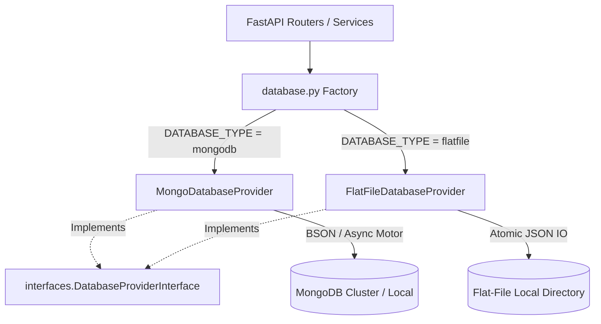
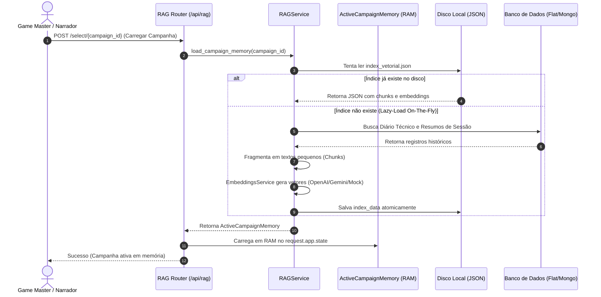
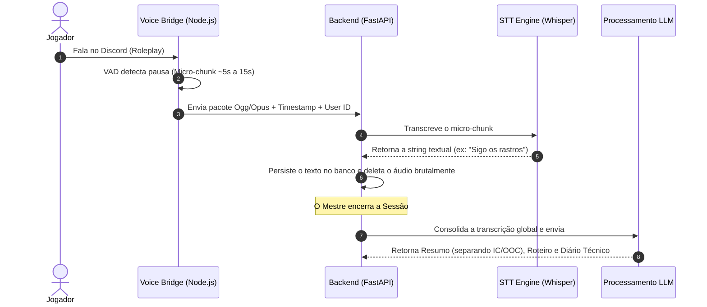

# 📚 Arquitetura e Estratégia Técnica — EchoBot

Este documento descreve as decisões arquiteturais fundamentais, o ecossistema de dados e a infraestrutura de inteligência artificial que sustentam o **EchoBot / Cronista das Sombras**.

---

## 1. Stack Tecnológico Principal

* **Backend:** FastAPI (Python 3.14+) com foco em concorrência assíncrona de alta performance, tipagem estática rigorosa e injeção de dependências robusta.
* **Voice Bridge:** Node.js (`discord.js` + `@discordjs/voice`) operando como microsserviço autônomo na captura de áudio bruto multicanal de canais de voz do Discord.
* **Frontend:** React 19 + Vite + TailwindCSS + Shadcn UI + Radix UI, sob o arquétipo visual *Premium Dark Fantasy*.
* **Persistência de Dados:** Arquitetura híbrida modular. Suporta nativamente **MongoDB (Local/Atlas)** e **Flat-Files (Arquivos JSON locais estruturados em disco)**, configuráveis instantaneamente.

---

## 2. Ecossistema de IA e Integrações

* **STT (Speech-to-Text):** Híbrido e resiliente. Motor principal local com *Faster Whisper* para total privacidade e latência zero, apoiado por *Cloud Fallback* assíncrono inteligente (OpenAI Whisper / Deepgram).
* **LLM (Orquestrador de Crônicas):** Motor multi-provedor (Gemini Flash, OpenAI GPT-4o, Anthropic Claude, Groq e OpenRouter) parametrizável em tempo real. Inclui mecanismos de failover automático caso a nuvem principal falhe.
* **TTS (Text-to-Speech):** Motor nativo baseado em *Kokoro (ONNX)* executando localmente e gerando locuções realistas a custo computacional e financeiro zero. Integrações opcionais em nuvem com ElevenLabs e Deepgram disponíveis.

---

## 3. Persistência Dual Configurável (MongoDB & Flat-Files)

Para garantir total portabilidade ("Zero-Config") e permitir que usuários rodem o EchoBot localmente de forma autônoma sem a necessidade de configurar um banco MongoDB, o sistema implementa uma camada abstrata de banco de dados.

### A. Design Pattern de Repositório Abstrato
Criamos contratos explícitos e genéricos de interface em `backend/app/interfaces.py`:
* **`IDatabaseProvider`**: Ponto de entrada unificado que expõe coleções para `campaigns`, `sessions`, `settings` e `character_mappings`.
* **`ICollection`**: Interface assíncrona que expõe operações CRUD compatíveis com MongoDB (`insert_one`, `find_one`, `update_one`, `delete_one`, `find`, `aggregate`).
* **`ICursor`**: Cursor assíncrono iterável (`async for`) que replica de forma leve o comportamento de paginação, ordenação e carregamento sob demanda do MongoDB.

### B. Flat-File Engine (`FlatFileDatabaseProvider`)
A implementação local armazena coleções como pastas de arquivos JSON individuais (`backend/data/<collection_name>/<document_id>.json`).
* **Escritas Atômicas Seguras**: Para evitar corrupção de dados sob concorrência, o provedor grava em um arquivo temporário (`.json.tmp`) e realiza uma substituição atômica (`os.replace`) no arquivo de destino.
* **Normalização MongoDB**: Converte automaticamente instâncias de tipos MongoDB específicos (como `bson.ObjectId` e `datetime` com fuso horário) para formatos padrão JSON amigáveis à serialização.

### C. Motor de Migração Canônico (`migrate_db.py`)
Disponibilizamos um utilitário robusto que permite aos Game Masters migrarem instantaneamente seus bancos históricos de produção do MongoDB para o armazenamento local Flat-File em apenas um clique:
* **Arquivo:** [migrate_db.py](file:///C:/Users/mukas/.gemini/antigravity/scratch/EchoBot/backend/migrate_db.py)
* **Funcionalidade**: Higieniza BSON dinamicamente, converte fuso-horários para string ISO-8601 e grava atomicamente no diretório local de destino do Flat-File.

---

## 4. Sistema RAG Local (Retrieval-Augmented Generation)

Com o crescimento das mesas de RPG, os diários e roteiros anteriores se tornam muito extensos para caber no limite de contexto das LLMs sem encarecer ou deixar o processamento lento. Introduzimos um **Mecanismo de Busca Semântica RAG Local**, alimentado por NumPy de alta velocidade.

### A. Arquitetura de Fluxo de Dados RAG

### B. Especificações Técnicas do RAG

#### 1. In-Memory Search Engine (`ActiveCampaignMemory`)
* **Representação NumPy**: Converte as listas de floats dos embeddings em matrizes `float32` do NumPy (`np.array`).
* **Normalização Antecipada**: Normaliza os vetores no momento da inicialização (`vectors / norms`). Isso simplifica o cálculo de similaridade por cosseno em um simples produto escalar por matriz dot-product (`np.dot(self.vectors, query_vector)`).
* **Velocidade**: Capaz de rodar buscas em milissegundos dentro do ciclo assíncrono do FastAPI, mesmo com dezenas de milhares de parágrafos históricos.

#### 2. Roteamento Inteligente de Embeddings (`EmbeddingsService`)
O sistema resolve dinamicamente a geração dos vetores (dimensão `1536`) de forma hierárquica:
1. **OpenAI (`text-embedding-3-small`)**: Executa se chaves descriptografadas estiverem disponíveis.
2. **Gemini (`models/text-embedding-004`)**: Executa se chaves do Google estiverem disponíveis.
3. **Resilient Local Mock Fallback**: Caso nenhuma chave seja configurada (ou em ambientes de testes e desenvolvimento isolados offline), o motor usa um gerador pseudo-aleatório baseado em hash SHA-256 do texto de entrada. Ele garante **vetores unitários normalizados determinísticos** e consistência absoluta sem realizar conexões com a rede externa.

#### 3. Endpoints da API RAG (`backend/app/routers/rag.py`)
Expostos de forma limpa para uso imediato no Frontend:
* `GET /api/rag/status/{campaign_id}`: Verifica a existência do índice físico e retorna metadados de atualização.
* `POST /api/rag/select/{campaign_id}`: Lazy-loads o índice em RAM (e reconstrói o índice on-the-fly de forma transparente caso a mesa nunca tenha sido indexada).
* `POST /api/rag/query`: Realiza a busca semântica global de maior relevância (`top_k`).
* `POST /api/rag/reindex/{campaign_id}`: Força a re-extração manual e reconstrução completa dos vetores.
* `POST /api/rag/unload`: Limpa a RAM liberando os recursos do servidor.

---

## 5. Fluxo de Processamento de Áudio (Micro-chunks / Streaming STT)

A inovação central para suplantar o gargalo do modelo em lotes (*Batch*) é o uso de Detecção de Atividade de Voz (VAD) para fatiar as falas em pequenos pedaços e realizar o bypass de armazenamento massivo, resolvendo a transcrição de forma contínua.

